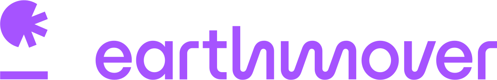

# Earth Sciences New Zealand Immersion Day

<table align="center">
  <tr>
    <td></td>
    <td width="80"></td>
    <td></td>
  </tr>
</table>

---

## Workshop Description

Welcome to the Earth Sciences New Zealand Immersion Day! This hands-on workshop demonstrates how to go "From Unified Data to Insight: Building a Cross-Organizational Weather Application" in just a few hours.

### What You'll Learn

As a NIWA, MetService, or GNS participant, you'll experience firsthand how modern cloud-native data tools can transform your workflow:

- **Discover and Access Data**: Learn how Earthmover's data catalog makes vast multi-dimensional datasets easily discoverable and instantly accessible, eliminating the usual data wrangling bottlenecks
- **Accelerated Analysis**: Experience the speed of performing complex analyses on large geospatial datasets using Xarray, Zarr and Icechunk - what used to take hours now takes minutes
- **Cross-Organizational Collaboration**: See how data from different sources can be seamlessly combined to create new insights and data products
- **Rapid Application Development**: Build a complete web application with interactive maps that queries live data - from concept to deployment in a single session

### What You'll Build

By the end of this workshop, you'll have:
1. Explored a comprehensive weather and climate data catalog
2. Performed real-world analysis on New Zealand climate data
3. Created a new derived data product by fusing multiple datasets
4. Built an interactive web map application that serves your analysis

This workshop demonstrates how the combined NIWA/MetService/GNS organizations can leverage modern data infrastructure to accelerate research, improve operational efficiency, and deliver better services to New Zealand.

## Workshop Details

**Format**: Two half-day virtual sessions inside an AWS sandbox
**Dates**:
- Day 1: Tuesday Sep 9 US / Wednesday Sep 10 NZ — 2:00–6:00 PM PT / 9:00 AM–1:00 PM NZT
- Day 2: Wednesday Sep 10 US / Thursday Sep 11 NZ — 2:00–6:00 PM PT / 9:00 AM–1:00 PM NZT

**Join Information**:
- Google Meet: (see calendar invite)
- Back-channel (Slack): [earthmover-community.slack.com](https://join.slack.com/t/earthmover-community/shared_invite/zt-2cwje92ir-xU3CfdG8BI~4CJOJy~sceQ)

## Learning Objectives
- Understand how Earthmover's components (Arraylake catalog, Icechunk, Xarray, Zarr, and Flux) create a high-performance, scalable platform for interacting with geospatial Earth system data and for building data applications and products
- Experience the speed and simplicity of performing analysis on large datasets using Xarray and Icechunk in a native Python environment
- Create and share a new, derived data product that can be used in a dashboard-style application via the Flux API

## Workshop Facilitators

**Earthmover Team**:
- Joe Hamman: Host, Lab 3 lead, closing
- Deepak Cherian: Lab 2 & Lab 4 co-lead
- Tom Nichols: Lab 0 & Lab 1 lead (Xarray/Zarr intro; catalog exploration)

**AWS Team**:
- Karl Stirneman: AWS Account Management
- Shivonne: AWS onboarding, sandbox + credits, technical support
- Steve: AWS onboarding, sandbox + credits, technical support

## Daily Agendas

### Day 1: Tuesday Sep 9 US / Wednesday Sep 10 NZ

| Time (NZT) | Time (PT) | Topic | Presenter |
|------------|-----------|-------|-----------|
| 9:00-9:30 AM | 2:00-2:30 PM | Welcome + Intros + Overview | Joe (Earthmover) + AWS team |
| 9:30-10:00 AM | 2:30-3:00 PM | AWS Onboarding | Steve + Shivonne (AWS) |
| 10:00-10:15 AM | 3:00-3:15 PM | **Break** | |
| 10:15-11:00 AM | 3:15-4:00 PM | Lab 0 - Introduction to Xarray and Zarr | Tom (Earthmover) |
| 11:00-11:10 AM | 4:00-4:10 PM | **Break** | |
| 11:10 AM-12:00 PM | 4:10-5:00 PM | Lab 1 - Catalog Exploration and Interaction | Tom (Earthmover) |
| 12:00-12:10 PM | 5:00-5:10 PM | **Break** | |
| 12:10-1:00 PM | 5:10-6:00 PM | Lab 2 - Initial Analysis | Deepak (Earthmover) |

### Day 2: Wednesday Sep 10 US / Thursday Sep 11 NZ

| Time (NZT) | Time (PT) | Topic | Presenter |
|------------|-----------|-------|-----------|
| 9:00-10:00 AM | 2:00-3:00 PM | Lab 3 - Create a New Data Product | Joe (Earthmover) |
| 10:00-10:30 AM | 3:00-3:30 PM | **Break** | |
| 10:30-11:30 AM | 3:30-4:30 PM | Lab 4 - Build a Map Dashboard | Deepak (Earthmover) |
| 11:30-11:40 AM | 4:30-4:40 PM | **Break** | |
| 11:40 AM-12:15 PM | 4:40-5:15 PM | Breakouts + Time to Explore + Questions | Earthmover and AWS teams |
| 12:15-1:00 PM | 5:15-6:00 PM | Wrap up | Joe (Earthmover) |

## AWS and Technical Details

- **AWS region**: `us-east-1`
- **AWS services required**: SageMaker, Standard S3 Bucket + [IAM Role](https://docs.earthmover.io/setup/manage-storage#aws-s3-buckets)
- **Notebook requirements**: See [requirements.txt](./requirements.txt)
- **AWS infrastructure requirements**: `ml.m5.4xlarge` (16 cpu, 64gb ram) or larger

> [!NOTE]
> If you are running the workshop notebooks outside of SageMaker, see the project `requirements.txt` for a complete listing of project dependencies.

## Key Links

- **Arraylake Org** → https://app.earthmover.io/earthsciencesnz
- **Workshop GitHub Repo** → https://github.com/earth-mover/earthsciencesnz-immersion-day

---

## License

  

This workshop content is licensed under the [Creative Commons Attribution 4.0 International License](https://creativecommons.org/licenses/by/4.0/). You are free to share, adapt, and build upon this material for any purpose, even commercially, as long as you provide appropriate attribution.

**Attribution**: Earth Sciences New Zealand Immersion Day Workshop Materials by Earthmover.
